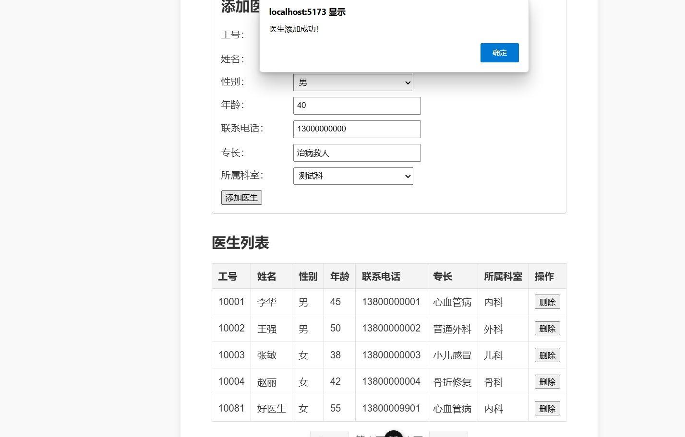

# 医院挂号管理系统的设计与实现

## 1. 引言
### 1.1 设计目的
设计一个医院挂号管理系统。

### 1.2 设计要求
以Postgresql、SQL Server或My SQL等作为后台数据库，以React、Vue、Angular等或其它开发工具作为前台开发工具，完成一个小型数据库应用系统的设计开发。
可以实现挂号信息的录入、查询和统计，科室信息的添加、修改和查询，医生信息的添加、修改和查询。

### 1.3 开发环境
这是一个基于 **Vue3 + Flask + PostgreSQL** 开发的小型医院挂号管理系统。
前端使用 TypeScript 和 Vue3，后端采用 Flask，数据库为 PostgreSQL。

### 1.4 同组人员
22336160 刘雄昊 主要负责前后端实现  
22336127 李煜 主要负责数据库设计、撰写实验报告

## 2. 概要设计
### 2.1 系统需求分析
#### 2.1.1 功能需求
##### 2.1.1.1 挂号管理
- **挂号信息录入**：允许用户输入患者的基本信息和挂号的科室、医生、时间等。
- **挂号信息查询**：允许用户根据患者姓名、挂号时间、科室等条件查询挂号信息。
- **挂号信息统计**：提供挂号数量、科室数量等统计数据。

##### 2.1.1.2 科室管理
- **科室信息添加**：允许管理员添加新的科室信息。
- **科室信息修改**：允许管理员修改现有科室的信息。
- **科室信息查询**：允许用户查询所有科室的详细信息。

##### 2.1.1.3 医生管理
- **医生信息添加**：允许管理员添加新的医生信息。
- **医生信息修改**：允许管理员修改现有医生的信息。
- **医生信息查询**：允许用户查询医生的详细信息，包括专业、可挂号时间等。


#### 2.1.2 性能需求
- 系统应能在短时间内处理大量挂号请求。
- 系统应保证数据的实时更新和准确性。

#### 2.1.3 安全需求
- 系统应确保患者隐私和数据安全。
- 系统应有权限控制，确保只有授权人员可以访问敏感信息。

#### 2.1.4 可用性需求
- 系统应提供友好的用户界面，易于操作。
- 系统应提供清晰的错误信息和帮助文档。

#### 2.1.5 用户需求
- **患者**：能够方便地挂号、查询挂号信息。
- **医生**：能够查看自己的挂号安排，管理患者信息。
- **管理员**：能够管理科室和医生信息，监控系统运行状态。

### 2.2 系统结构设计

#### 2.2.1 系统架构
- **前后端分离架构**：前端使用 Vue3 构建用户界面，后端使用 Flask 提供 API 服务，数据库使用 PostgreSQL 存储数据。

- **项目文件结构**
  - **后端**
```
backend/
├── app/
│   ├── __init__.py         # 初始化 Flask 应用
│   ├── config.py           # 数据库配置文件
│   ├── models.py           # 数据库 ORM 模型
│   ├── routes.py           # API 路由
│   ├── database.py         # 数据库初始化和工具函数
│   ├── sql_scripts/        # SQL 初始化脚本
│   │   ├── create_tables.sql
│   │   ├── insert_*.sql    # 样例数据插入脚本
│   │   ├── init_database.sql # 数据库初始化脚本
│   └── utils.py            # 执行 SQL 脚本的工具函数
└── run.py                  # 后端启动入口
```

  - **前端**
```
frontend/
├── src/
│   ├── assets/             # 静态资源文件 (CSS, 图像等)
│   ├── components/         # 通用组件
│   ├── pages/              # 页面级组件 (Patients.vue, Doctors.vue 等)
│   ├── router/             # Vue Router 配置
│   ├── App.vue             # 根组件
│   ├── main.ts             # 应用入口文件
└── vite.config.ts          # Vite 配置文件
```

#### 2.2.2 系统模块

##### 2.2.2.1 前端模块
- **用户界面（UI）**：使用 Vue3 和 TypeScript 构建，提供用户交互界面。
- **状态管理**：使用 Vuex 管理前端状态。
- **路由管理**：使用 Vue Router 管理页面路由。

##### 2.2.2.2 后端模块
- **API 服务**：使用 Flask 框架构建 RESTful API。
- **业务逻辑**：处理前端请求，执行业务规则。
- **数据访问**：与 PostgreSQL 数据库交互，执行数据的增删改查。

##### 2.2.2.3 数据库模块
- **数据存储**：使用 PostgreSQL 存储患者信息、医生信息、科室信息和挂号信息。

#### 2.2.3 系统交互流程
- 用户通过前端界面发起请求。
- 前端通过 HTTP 请求与后端 API 交互。
- 后端接收到请求后，执行相应的业务逻辑。
- 后端与数据库交互，执行数据操作。
- 后端将结果返回给前端。
- 前端根据返回结果更新用户界面。

### 2.3 功能模块设计
#### 2.3.1 患者信息管理模块
- 前端：提供界面供用户查看、添加、编辑和删除患者信息。
- 后端：提供 API 供前端调用，处理患者信息的增删改查。

#### 2.3.2 医生信息管理模块
- 前端：提供界面供管理员查看、添加、编辑和删除医生信息。
- 后端：提供 API 供前端调用，处理医生信息的增删改查。

#### 2.3.3 科室管理模块
- 前端：提供界面供管理员查看、添加、编辑和删除科室信息。
- 后端：提供 API 供前端调用，处理科室信息的增删改查。

#### 2.3.4 挂号管理模块
- 前端：提供界面供患者挂号、查看挂号记录。
- 后端：提供 API 供前端调用，处理挂号的增删改查。

#### 2.3.4 用户登录模块
- 前端：提供界面让用户输入用户名和密码。
- 后端：检查数据库中是否存在该用户名，并且密码是否匹配。

## 3. 详细设计
### 3.1 系统结构框架
#### **系统功能模块图**


#### **用户组织架构图**


#### **逻辑结构设计**
- **数据库概念模型E-R图**


#### **关系模式（满足3NF）**
1. 患者表 (Patients)
主键：patient_id
属性：
patient_id (患者ID)
name (患者姓名)
gender (患者性别)
phone (患者电话)
primary_doctor_id (主治医生ID，外键，关联 Doctors 表)
2. 科室表 (Departments)
主键：department_id
属性：
department_id (科室ID)
name (科室名称)
phone (科室电话)
3. 医生表 (Doctors)
主键：doctor_id
属性：
doctor_id (医生ID)
name (医生姓名)
gender (医生性别)
age (医生年龄)
phone (医生电话)
specialization (医生擅长领域)
department_id (所属科室ID，外键，关联 Departments 表)
4. 挂号表 (Registrations)
主键：registration_id
属性：
registration_id (挂号单编号)
patient_id (患者ID，外键，关联 Patients 表)
doctor_id (医生ID，外键，关联 Doctors 表)
department_id (科室ID，外键，关联 Departments 表)
registration_date (挂号日期)
visit_type (就诊类型：初诊/复诊)

### 3.2 数据库设计

根据数据库E-R图和关系模式创建数据库表

##### 代码实现
在`model.py`中定义科室、医生、患者和挂号类，然后用SQLAlchemy中的create_all()函数自动创建表
创建User类用于处理登录的用户信息，其中需要包括user, password, role等信息。
```python
# 定义科室类
class Department(db.Model):
    __tablename__ = "departments"
    id = db.Column(db.Integer, primary_key=True)
    name = db.Column(db.String(100), nullable=False)
    phone = db.Column(db.String(20), nullable=False)

# 定义医生类
class Doctor(db.Model):
    __tablename__ = "doctors"
    id = db.Column(db.Integer, primary_key=True)
    name = db.Column(db.String(100), nullable=False)
    gender = db.Column(db.String(1), nullable=False)
    age = db.Column(db.Integer, nullable=False)
    phone = db.Column(db.String(20), nullable=False)
    specialization = db.Column(db.String(100), nullable=False)
    department_id = db.Column(db.Integer, db.ForeignKey("departments.id"))

# 定义患者类
class Patient(db.Model):
    __tablename__ = "patients"
    id = db.Column(db.Integer, primary_key=True)
    name = db.Column(db.String(100), nullable=False)
    gender = db.Column(db.String(1), nullable=False)
    phone = db.Column(db.String(20), nullable=False)
    primary_doctor_id = db.Column(db.Integer, db.ForeignKey("doctors.id"))

# 定义挂号类
class Registration(db.Model):
    __tablename__ = "registrations"
    id = db.Column(db.Integer, primary_key=True)
    patient_id = db.Column(db.Integer, db.ForeignKey("patients.id"))
    doctor_id = db.Column(db.Integer, db.ForeignKey("doctors.id"))
    department_id = db.Column(db.Integer, db.ForeignKey("departments.id"))
    registration_date = db.Column(db.Date, nullable=False)
    visit_type = db.Column(db.String(10), nullable=False)

# 定义用户类
class User(db.Model):
    __tablename__ = 'users'

    id = Column(Integer, primary_key=True)
    username = Column(String(50), unique=True, nullable=False)
    password = Column(String(50), nullable=False)
    role = Column(String(20), nullable=False)
```
### 3.3 挂号管理
#### 3.2.1 挂号信息录入
##### 代码展示
```python
# 添加挂号信息
@api.route('/registrations', methods=['POST'])
def add_registration():
    try:
        data = request.json

        # 检查必要字段是否存在
        if not all(key in data for key in ["patient_id", "doctor_id", "department_id", "registration_date"]):
            return jsonify({"error": "缺少必要字段"}), 400

        # 检查是否提供了挂号单 ID
        if "id" not in data or not data["id"]:
            import random
            # 动态生成一个未使用的 8 位数字 ID
            existing_ids = {r.id for r in db.session.query(Registration.id).all()}
            while True:
                new_id = f"{random.randint(1, 99999999):08d}"  # 生成8位数ID
                if new_id not in existing_ids:
                    break
            data["id"] = new_id

        # 创建挂号记录
        new_registration = Registration(
            id=data["id"],
            patient_id=data["patient_id"],
            doctor_id=data["doctor_id"],
            department_id=data["department_id"],
            registration_date=data["registration_date"],
            visit_type=data["visit_type"]
        )

        db.session.add(new_registration)
        db.session.commit()

        return jsonify({"message": "挂号成功！", "registration_id": new_registration.id}), 201

    except Exception as e:
        print("添加挂号时出错:", str(e))
        return jsonify({"error": "添加挂号失败", "details": str(e)}), 500
```

##### 代码描述
1. 路由定义
    - `@api.route('/registrations', methods=['POST'])`：使用Flask的装饰器定义了一个路由，路径为`/registrations`，支持HTTP POST请求。这意味着当客户端发送POST请求到`/registrations`时，会触发这个函数。

2. 请求数据获取
    - `data = request.json`：从请求的JSON体中获取数据。`request.json`会自动解析请求体中的JSON数据，并将其转换为Python字典。这个字典包含了添加挂号信息所需的数据。

3. 数据验证
    - **检查必要字段**：使用列表推导式和`all()`函数检查请求数据中是否包含所有必要的字段`patient_id`、`doctor_id`、`department_id`和`registration_date`。如果缺少任何一个必要字段，则返回一个JSON响应，包含错误消息`"缺少必要字段"`，HTTP状态码为400（Bad Request）。

4. 挂号单ID处理
    - **检查挂号单ID**：首先检查请求数据中是否提供了`id`字段，如果`id`不存在或为空，则进入动态生成ID的逻辑。
    - **动态生成ID**：
        - 使用`db.session.query(Registration.id).all()`查询挂号表中所有已存在的ID，并将其存储在集合`existing_ids`中。
        - 使用`random.randint(1, 99999999)`生成一个1到99999999之间的随机整数，然后使用`f"{...:08d}"`格式化为8位数字字符串（不足8位时前面补0）。
        - 通过`while`循环不断生成新的ID，直到生成的ID不在`existing_ids`中，确保新生成的ID是唯一的。
        - 将生成的唯一ID赋值给`data["id"]`。

5. 挂号记录创建与存储
    - 使用请求数据创建一个新的`Registration`对象`new_registration`，并设置其属性：
        - `id`：挂号单的唯一标识符。
        - `patient_id`：患者的ID。
        - `doctor_id`：医生的ID。
        - `department_id`：科室的ID。
        - `registration_date`：挂号日期。
        - `visit_type`：就诊类型。
    - 使用`db.session.add(new_registration)`将新挂号记录添加到数据库会话中。
    - 调用`db.session.commit()`提交事务，将新挂号记录保存到数据库中。

6. 响应处理
    - **成功响应**：如果挂号信息添加成功，返回一个JSON响应，包含成功消息`"挂号成功！"`和新添加挂号记录的ID（`registration_id`），HTTP状态码为201（Created）。
    - **异常处理**：如果在添加挂号信息过程中发生异常（如数据格式错误、数据库操作失败等），捕获异常并执行以下操作：
        - 打印错误日志，输出错误信息`"添加挂号时出错:"`和异常的详细信息`str(e)`。
        - 返回一个JSON响应，包含错误消息`"添加挂号失败"`和异常的详细信息`str(e)`，HTTP状态码为500（Internal Server Error）。

#### 3.2.2 挂号信息查询
##### 代码展示
```python
# 用于查询挂号表的所有数据
@api.route("/registrations", methods=["GET"])
def get_registrations():
    page = request.args.get('page', default=1, type=int)
    per_page = request.args.get('per_page', default=10, type=int)

    # 查询挂号数据
    query = Registration.query
    pagination = query.paginate(page=page, per_page=per_page, error_out=False)

    registrations = [
        {
            "id": reg.id,
            "patient_name": Patient.query.get(reg.patient_id).name if reg.patient_id else None,
            "doctor_name": Doctor.query.get(reg.doctor_id).name if reg.doctor_id else None,
            "department_name": Department.query.get(reg.department_id).name if reg.department_id else None,
            "registration_date": reg.registration_date.strftime("%Y-%m-%d"),
            "visit_type": reg.visit_type,
        }
        for reg in pagination.items
    ]

    return jsonify({
        "registrations": registrations,
        "total": pagination.total,
        "page": pagination.page,
        "per_page": pagination.per_page
    })
```

##### 代码描述
1. 路由定义
    - `@api.route("/registrations", methods=["GET"])`：使用Flask的装饰器定义了一个路由，路径为`/registrations`，支持HTTP GET请求。这意味着当客户端发送GET请求到`/registrations`时，会触发这个函数。

2. 参数获取
    - `page = request.args.get('page', default=1, type=int)`：从请求的查询参数中获取`page`参数，表示当前页码。如果请求中没有提供`page`参数，则默认为1，并且将参数转换为整数类型。
    - `per_page = request.args.get('per_page', default=10, type=int)`：从请求的查询参数中获取`per_page`参数，表示每页显示的数据条数。如果请求中没有提供`per_page`参数，则默认为10，并且将参数转换为整数类型。

3. 数据查询
    - `query = Registration.query`：创建一个查询对象，用于查询挂号表中的数据。`Registration`是一个ORM模型，代表挂号表，`query`是SQLAlchemy提供的查询构造器。
    - `pagination = query.paginate(page=page, per_page=per_page, error_out=False)`：使用SQLAlchemy的`paginate`方法对查询结果进行分页处理。`page`和`per_page`参数用于指定当前页码和每页条数，`error_out=False`表示当请求的页码超出范围时，不抛出404错误，而是返回空列表。

4. 数据处理与返回
    - 使用列表推导式遍历`pagination.items`，即当前页的挂号记录，将每个挂号对象转换为一个字典，包含以下信息：
        - `id`：挂号记录的ID。
        - `patient_name`：通过`Patient.query.get(reg.patient_id).name`关联查询患者的姓名，如果`patient_id`为`None`，则`patient_name`也为`None`。
        - `doctor_name`：通过`Doctor.query.get(reg.doctor_id).name`关联查询医生的姓名，如果`doctor_id`为`None`，则`doctor_name`也为`None`。
        - `department_name`：通过`Department.query.get(reg.department_id).name`关联查询科室的名称，如果`department_id`为`None`，则`department_name`也为`None`。
        - `registration_date`：挂号日期，使用`strftime("%Y-%m-%d")`格式化为字符串形式。
        - `visit_type`：就诊类型。
    - 将处理后的挂号数据列表`registrations`以及分页信息（总记录数`pagination.total`、当前页码`pagination.page`、每页条数`pagination.per_page`）封装到一个字典中。
    - 使用`jsonify`函数将字典转换为JSON格式，并返回给客户端。`jsonify`是Flask提供的一个函数，用于将Python字典转换为JSON响应体，并设置响应的Content-Type为`application/json`。

#### 3.2.3挂号信息删除
##### 代码展示
```python
# 删除挂号记录
@api.route('/registrations/<int:registration_id>', methods=['DELETE'])
def delete_registration(registration_id):
    try:
        # 查找挂号记录
        registration = db.session.query(Registration).filter_by(id=registration_id).first()
        if not registration:
            return jsonify({"error": "挂号记录不存在"}), 404

        # 删除挂号记录
        db.session.delete(registration)
        db.session.commit()

        return jsonify({"message": "挂号记录已删除"}), 200

    except Exception as e:
        print("删除挂号时出错:", str(e))
        return jsonify({"error": "删除挂号失败", "details": str(e)}), 500
```

##### 代码描述
1. 路由定义
    - `@api.route('/registrations/<int:registration_id>', methods=['DELETE'])`：使用Flask的装饰器定义了一个路由，路径为`/registrations/<int:registration_id>`，支持HTTP DELETE请求。`<int:registration_id>`是一个路径参数，表示要删除的挂号记录的ID，且该参数被指定为整数类型。这意味着当客户端发送DELETE请求到`/registrations/123`（假设123是挂号记录的ID）时，会触发这个函数。

2. 挂号记录查找
    - `registration = db.session.query(Registration).filter_by(id=registration_id).first()`：使用SQLAlchemy的查询构造器`db.session.query`来查询挂号表（`Registration`），并使用`filter_by(id=registration_id)`过滤条件查找ID等于`registration_id`的挂号记录。`.first()`方法用于获取查询结果中的第一条记录，如果存在多条符合条件的记录，只返回第一条；如果没有找到符合条件的记录，则返回`None`。

3. 删除操作
    - **检查记录是否存在**：如果`registration`为`None`，表示没有找到指定ID的挂号记录，返回一个JSON响应，包含错误消息`"挂号记录不存在"`，HTTP状态码为404（Not Found）。
    - **删除记录**：如果找到了挂号记录，使用`db.session.delete(registration)`将该记录从数据库会话中删除。
    - **提交事务**：调用`db.session.commit()`提交事务，将删除操作永久保存到数据库中。

4. 响应处理
    - **成功响应**：如果挂号记录删除成功，返回一个JSON响应，包含成功消息`"挂号记录已删除"`，HTTP状态码为200（OK）。
    - **异常处理**：如果在删除挂号记录过程中发生异常（如数据库操作失败等），捕获异常并执行以下操作：
        - 打印错误日志，输出错误信息`"删除挂号时出错:"`和异常的详细信息`str(e)`。
        - 返回一个JSON响应，包含错误消息`"删除挂号失败"`和异常的详细信息`str(e)`，HTTP状态码为500（Internal Server Error）。

### 3.4 科室管理
#### 3.3.1 科室信息添加
##### 代码展示
```python
# 添加科室
@api.route('/departments', methods=['POST'])
def add_department():
    try:
        data = request.json

        # 验证数据
        if not data.get("name") or not data.get("phone"):
            return jsonify({"error": "缺少必要字段：name 或 phone"}), 400

        # 创建新科室
        new_department = Department(
            id=data["id"],
            name=data["name"],
            phone=data["phone"]
        )

        db.session.add(new_department)
        db.session.commit()

        return jsonify({"message": "科室添加成功！", "department_id": new_department.id}), 201

    except Exception as e:
        print("添加科室时出错:", str(e))
        return jsonify({"error": "添加科室失败", "details": str(e)}), 500
```

##### 代码描述
1. 路由定义
    - `@api.route('/departments', methods=['POST'])`：使用Flask的装饰器定义了一个路由，路径为`/departments`，支持HTTP POST请求。这意味着当客户端发送POST请求到`/departments`时，会触发这个函数。

2. 请求数据获取
    - `data = request.json`：从请求的JSON体中获取数据。`request.json`会自动解析请求体中的JSON数据，并将其转换为Python字典。这个字典包含了添加科室所需的信息，如`id`、`name`和`phone`。

3. 数据验证
    - 在创建新科室之前，先验证请求数据中是否包含必要的字段`name`和`phone`。如果`name`或`phone`字段为空或不存在，则返回一个JSON响应，包含错误消息`"缺少必要字段：name 或 phone"`，HTTP状态码为400（Bad Request）。

4. 科室数据创建与存储
    - 使用请求数据创建一个新的`Department`对象`new_department`，并设置其属性：
        - `id`：科室的唯一标识符。
        - `name`：科室的名称。
        - `phone`：科室的联系电话。
    - 使用`db.session.add(new_department)`将新科室对象添加到数据库会话中。
    - 调用`db.session.commit()`提交事务，将新科室数据保存到数据库中。

5. 响应处理
    - **成功响应**：如果科室添加成功，返回一个JSON响应，包含成功消息`"科室添加成功！"`和新添加科室的ID（`department_id`），HTTP状态码为201（Created）。
    - **异常处理**：如果在添加科室过程中发生异常（如数据格式错误、数据库操作失败等），捕获异常并执行以下操作：
        - 打印错误日志，输出错误信息`"添加科室时出错:"`和异常的详细信息`str(e)`。
        - 返回一个JSON响应，包含错误消息`"添加科室失败"`和异常的详细信息`str(e)`，HTTP状态码为500（Internal Server Error）。

#### 3.3.2 科室信息查询
##### 代码展示
```python
# 用于查询科室表的所有数据
@api.route('/departments', methods=['GET'])
def get_departments():
    page = request.args.get('page', default=1, type=int)
    per_page = request.args.get('per_page', default=10, type=int)

    # 查询科室数据
    query = Department.query
    result = paginate_query(query, page, per_page)

    # 返回数据
    departments = [
        {
            "id": department.id,
            "name": department.name,
            "phone": department.phone
        } for department in result["items"]
    ]
    return jsonify({
        "departments": departments,
        "total": result["total"],
        "page": result["page"],
        "per_page": result["per_page"]
    })
```
##### 代码描述
1. 路由定义
    - `@api.route('/departments', methods=['GET'])`：使用Flask的装饰器定义了一个路由，路径为`/departments`，支持HTTP GET请求。这意味着当客户端发送GET请求到`/departments`时，会触发这个函数。

2. 参数获取
    - `page = request.args.get('page', default=1, type=int)`：从请求的查询参数中获取`page`参数，表示当前页码。如果请求中没有提供`page`参数，则默认为1，并且将参数转换为整数类型。
    - `per_page = request.args.get('per_page', default=10, type=int)`：从请求的查询参数中获取`per_page`参数，表示每页显示的数据条数。如果请求中没有提供`per_page`参数，则默认为10，并且将参数转换为整数类型。

3. 数据查询
    - `query = Department.query`：创建一个查询对象，用于查询科室表中的数据。`Department`是一个ORM模型，代表科室表，`query`是SQLAlchemy提供的查询构造器。
    - `result = paginate_query(query, page, per_page)`：调用`paginate_query`函数对查询结果进行分页处理。`paginate_query`函数接收查询对象、当前页码和每页条数作为参数，返回一个包含分页信息的结果对象。这个函数的具体实现代码未给出，但可以推测它会执行分页查询，并返回包含当前页数据、总数据量、当前页码和每页条数等信息的字典。

4. 数据处理与返回
    - 使用列表推导式遍历`result["items"]`，即当前页的科室数据，将每个科室对象转换为一个字典，包含科室的`id`、`name`和`phone`属性。
    - 将处理后的科室数据列表`departments`以及分页信息（总数据量`total`、当前页码`page`、每页条数`per_page`）封装到一个字典中。
    - 使用`jsonify`函数将字典转换为JSON格式，并返回给客户端。`jsonify`是Flask提供的一个函数，用于将Python字典转换为JSON响应体，并设置响应的Content-Type为`application/json`。

#### 3.3.3 科室信息删除
##### 代码展示
```python
# 删除科室
@api.route('/departments/<int:department_id>', methods=['DELETE'])
def delete_department(department_id):
    try:
        # 查找科室记录
        department = db.session.query(Department).filter_by(id=department_id).first()
        if not department:
            return jsonify({"error": "科室记录不存在"}), 404

        # 删除科室记录
        db.session.delete(department)
        db.session.commit()

        return jsonify({"message": "科室已删除"}), 200

    except Exception as e:
        print("删除科室时出错:", str(e))
        return jsonify({"error": "删除科室失败", "details": str(e)}), 500
```

##### 代码描述
1. 路由定义
    - `@api.route('/departments/<int:department_id>', methods=['DELETE'])`：使用Flask的装饰器定义了一个路由，路径为`/departments/<int:department_id>`，支持HTTP DELETE请求。`<int:department_id>`是一个路径参数，表示要删除的科室记录的ID，且该参数被指定为整数类型。这意味着当客户端发送DELETE请求到`/departments/123`（假设123是科室记录的ID）时，会触发这个函数。

2. 科室记录查找
    - `department = db.session.query(Department).filter_by(id=department_id).first()`：使用SQLAlchemy的查询构造器`db.session.query`来查询科室表（`Department`），并使用`filter_by(id=department_id)`过滤条件查找ID等于`department_id`的科室记录。`.first()`方法用于获取查询结果中的第一条记录，如果存在多条符合条件的记录，只返回第一条；如果没有找到符合条件的记录，则返回`None`。

3. 删除操作
    - **检查记录是否存在**：如果`department`为`None`，表示没有找到指定ID的科室记录，返回一个JSON响应，包含错误消息`"科室记录不存在"`，HTTP状态码为404（Not Found）。
    - **删除记录**：如果找到了科室记录，使用`db.session.delete(department)`将该记录从数据库会话中删除。
    - **提交事务**：调用`db.session.commit()`提交事务，将删除操作永久保存到数据库中。

4. 响应处理
    - **成功响应**：如果科室记录删除成功，返回一个JSON响应，包含成功消息`"科室已删除"`，HTTP状态码为200（OK）。
    - **异常处理**：如果在删除科室记录过程中发生异常（如数据库操作失败等），捕获异常并执行以下操作：
        - 打印错误日志，输出错误信息`"删除科室时出错:"`和异常的详细信息`str(e)`。
        - 返回一个JSON响应，包含错误消息`"删除科室失败"`和异常的详细信息`str(e)`，HTTP状态码为500（Internal Server Error）。

### 3.5 医生管理
#### 3.4.1 医生信息添加
##### 代码展示
```python
# 用于添加医生
@api.route('/doctors', methods=['POST'])
def add_doctor():
    data = request.json
    try:
        new_doctor = Doctor(
            id=data['id'],
            name=data['name'],
            gender=data['gender'],
            age=data['age'],
            phone=data['phone'],
            specialization=data['specialization'],
            department_id=data['department_id'],
        )
        db.session.add(new_doctor)
        db.session.commit()
        return jsonify({"message": "医生添加成功！"}), 201
    except Exception as e:
        db.session.rollback()
        return jsonify({"message": "医生添加失败！", "error": str(e)}), 400
```

##### 代码描述
1. 路由定义
    - `@api.route('/doctors', methods=['POST'])`：使用Flask的装饰器定义了一个路由，路径为`/doctors`，支持HTTP POST请求。这意味着当客户端发送POST请求到`/doctors`时，会触发这个函数。

2. 请求数据获取
    - `data = request.json`：从请求的JSON体中获取数据。`request.json`会自动解析请求体中的JSON数据，并将其转换为Python字典。这个字典包含了添加医生所需的所有信息，如`id`、`name`、`gender`、`age`、`phone`、`specialization`和`department_id`。

3. 医生数据创建与存储
    - 使用请求数据创建一个新的`Doctor`对象`new_doctor`，并设置其属性。这些属性包括：
        - `id`：医生的唯一标识符。
        - `name`：医生的姓名。
        - `gender`：医生的性别。
        - `age`：医生的年龄。
        - `phone`：医生的联系电话。
        - `specialization`：医生的专业领域。
        - `department_id`：医生所属的科室ID。
    - 使用`db.session.add(new_doctor)`将新医生对象添加到数据库会话中。
    - 调用`db.session.commit()`提交事务，将新医生数据保存到数据库中。

4. 响应处理
    - **成功响应**：如果医生添加成功，返回一个JSON响应，包含成功消息`"医生添加成功！"`，HTTP状态码为201（Created）。
    - **异常处理**：如果在添加医生过程中发生异常（如数据格式错误、数据库操作失败等），捕获异常并执行以下操作：
        - 使用`db.session.rollback()`回滚数据库事务，以确保数据库状态的一致性。
        - 返回一个JSON响应，包含错误消息`"医生添加失败！"`和异常的详细信息`str(e)`，HTTP状态码为400（Bad Request）。


#### 3.4.2 医生信息查询
##### 代码展示
```python
# 用于查询医生表的所有数据
@api.route("/doctors", methods=["GET"])
def get_doctors():
    page = request.args.get('page', default=1, type=int)
    per_page = request.args.get('per_page', default=10, type=int)

    # 查询医生数据
    query = Doctor.query
    result = paginate_query(query, page, per_page)

    # 返回数据
    doctors = [
        {
            "id": doctor.id,
            "name": doctor.name,
            "gender": doctor.gender,
            "age": doctor.age,
            "phone": doctor.phone,
            "specialization": doctor.specialization,
            "department_name": Department.query.get(doctor.department_id).name if doctor.department_id else None
        } for doctor in result["items"]
    ]
    return jsonify({
        "doctors": doctors,
        "total": result["total"],
        "page": result["page"],
        "per_page": result["per_page"]
    })
```

##### 代码描述
1. 路由定义
    - `@api.route("/doctors", methods=["GET"])`：使用Flask的装饰器定义了一个路由，路径为`/doctors`，支持HTTP GET请求。这意味着当客户端发送GET请求到`/doctors`时，会触发这个函数。

2. 参数获取
    - `page = request.args.get('page', default=1, type=int)`：从请求的查询参数中获取`page`参数，表示当前页码。如果请求中没有提供`page`参数，则默认为1，并且将参数转换为整数类型。
    - `per_page = request.args.get('per_page', default=10, type=int)`：从请求的查询参数中获取`per_page`参数，表示每页显示的数据条数。如果请求中没有提供`per_page`参数，则默认为10，并且将参数转换为整数类型。

3. 数据查询
    - `query = Doctor.query`：创建一个查询对象，用于查询医生表中的数据。`Doctor`是一个ORM模型，代表医生表，`query`是SQLAlchemy提供的查询构造器。
    - `result = paginate_query(query, page, per_page)`：调用`paginate_query`函数对查询结果进行分页处理。`paginate_query`函数接收查询对象、当前页码和每页条数作为参数，返回一个包含分页信息的结果对象。这个函数的具体实现代码未给出，但可以推测它会执行分页查询，并返回包含当前页数据、总数据量、当前页码和每页条数等信息的字典。

4. 数据处理与返回
    - 使用列表推导式遍历`result["items"]`，即当前页的医生数据，将每个医生对象转换为一个字典，包含医生的`id`、`name`、`gender`、`age`、`phone`、`specialization`属性。
    - 对于`department_name`属性，使用`Department.query.get(doctor.department_id).name`来关联查询医生所属的科室名称。如果医生的`department_id`存在，则查询对应的科室对象并获取其名称；如果`department_id`为`None`，则`department_name`也为`None`。
    - 将处理后的医生数据列表`doctors`以及分页信息（总数据量`total`、当前页码`page`、每页条数`per_page`）封装到一个字典中。
    - 使用`jsonify`函数将字典转换为JSON格式，并返回给客户端。`jsonify`是Flask提供的一个函数，用于将Python字典转换为JSON响应体，并设置响应的Content-Type为`application/json`。

#### 3.4.3 医生信息删除
##### 代码展示
```python
# 删除医生记录
@api.route('/doctors/<int:doctor_id>', methods=['DELETE'])
def delete_doctor(doctor_id):
    try:
        # 查找医生记录
        doctor = db.session.query(Doctor).filter_by(id=doctor_id).first()
        if not doctor:
            return jsonify({"error": "医生记录不存在"}), 404

        # 删除医生记录
        db.session.delete(doctor)
        db.session.commit()

        return jsonify({"message": "医生已删除"}), 200

    except Exception as e:
        print("删除科室时出错:", str(e))
        return jsonify({"error": "删除医生失败", "details": str(e)}), 500
```

##### 代码描述
1. 路由定义
    - `@api.route('/doctors/<int:doctor_id>', methods=['DELETE'])`：使用Flask的装饰器定义了一个路由，路径为`/doctors/<int:doctor_id>`，支持HTTP DELETE请求。`<int:doctor_id>`是一个路径参数，表示要删除的医生记录的ID，且该参数被指定为整数类型。这意味着当客户端发送DELETE请求到`/doctors/123`（假设123是医生记录的ID）时，会触发这个函数。

2. 医生记录查找
    - `doctor = db.session.query(Doctor).filter_by(id=doctor_id).first()`：使用SQLAlchemy的查询构造器`db.session.query`来查询医生表（`Doctor`），并使用`filter_by(id=doctor_id)`过滤条件查找ID等于`doctor_id`的医生记录。`.first()`方法用于获取查询结果中的第一条记录，如果存在多条符合条件的记录，只返回第一条；如果没有找到符合条件的记录，则返回`None`。

3. 删除操作
    - **检查记录是否存在**：如果`doctor`为`None`，表示没有找到指定ID的医生记录，返回一个JSON响应，包含错误消息`"医生记录不存在"`，HTTP状态码为404（Not Found）。
    - **删除记录**：如果找到了医生记录，使用`db.session.delete(doctor)`将该记录从数据库会话中删除。
    - **提交事务**：调用`db.session.commit()`提交事务，将删除操作永久保存到数据库中。

4. 响应处理
    - **成功响应**：如果医生记录删除成功，返回一个JSON响应，包含成功消息`"医生已删除"`，HTTP状态码为200（OK）。
    - **异常处理**：如果在删除医生记录过程中发生异常（如数据库操作失败等），捕获异常并执行以下操作：
        - 打印错误日志，输出错误信息`"删除科室时出错:"`和异常的详细信息`str(e)`。这里需要注意，日志信息中提到的是“删除科室时出错”，这可能是一个笔误，应该是“删除医生时出错”。
        - 返回一个JSON响应，包含错误消息`"删除医生失败"`和异常的详细信息`str(e)`，HTTP状态码为500（Internal Server Error）。

### 3.6 患者管理
#### 3.5.1 患者信息录入
##### 代码展示
```python
# 用于添加患者
@api.route('/patients', methods=['POST'])
def add_patient():
    try:
        data = request.json

        # 检查是否提供了患者 ID
        if "id" not in data or not data["id"]:
            import random
            # 动态生成一个未使用的 7 位数字 ID
            existing_ids = {p.id for p in db.session.query(Patient.id).all()}
            while True:
                new_id = f"{random.randint(1, 9999999):07d}"  # 生成7位数ID
                if new_id not in existing_ids:
                    break
            data["id"] = new_id

        # 创建新患者
        new_patient = Patient(
            id=data["id"],
            name=data["name"],
            gender=data["gender"],
            phone=data["phone"],
            primary_doctor_id=data["primary_doctor_id"],
        )

        db.session.add(new_patient)
        db.session.commit()

        return jsonify({"message": "患者添加成功！", "id": data["id"]}), 201

    except Exception as e:
        # 打印错误日志
        print("添加患者时出错:", str(e))
        return jsonify({"error": "添加患者失败，请检查数据！", "details": str(e)}), 400
```

##### 代码描述
1. 路由定义
    - `@api.route('/patients', methods=['POST'])`：使用Flask的装饰器定义了一个路由，路径为`/patients`，支持HTTP POST请求。这意味着当客户端发送POST请求到`/patients`时，会触发这个函数。

2. 请求数据获取
    - `data = request.json`：从请求的JSON体中获取数据。`request.json`会自动解析请求体中的JSON数据，并将其转换为Python字典。

3. 患者ID处理
    - **检查患者ID**：首先检查请求数据中是否提供了`id`字段，如果`id`不存在或为空，则进入动态生成ID的逻辑。
    - **动态生成ID**：
        - 使用`db.session.query(Patient.id).all()`查询患者表中所有已存在的ID，并将其存储在集合`existing_ids`中。
        - 使用`random.randint(1, 9999999)`生成一个1到9999999之间的随机整数，然后使用`f"{...:07d}"`格式化为7位数字字符串（不足7位时前面补0）。
        - 通过`while`循环不断生成新的ID，直到生成的ID不在`existing_ids`中，确保新生成的ID是唯一的。
        - 将生成的唯一ID赋值给`data["id"]`。

4. 患者数据创建与存储
    - 使用请求数据创建一个新的`Patient`对象`new_patient`，并设置其属性（`id`、`name`、`gender`、`phone`、`primary_doctor_id`）。
    - 使用`db.session.add(new_patient)`将新患者对象添加到数据库会话中。
    - 调用`db.session.commit()`提交事务，将新患者数据保存到数据库中。

5. 响应处理
    - **成功响应**：如果患者添加成功，返回一个JSON响应，包含成功消息`"患者添加成功！"`和新添加患者的ID，HTTP状态码为201（Created）。
    - **异常处理**：如果在添加患者过程中发生异常（如数据格式错误、数据库操作失败等），捕获异常并打印错误日志。返回一个JSON响应，包含错误消息`"添加患者失败，请检查数据！"`和异常的详细信息，HTTP状态码为400（Bad Request）。

#### 3.5.2 患者信息查询
##### 代码展示
```python
# 用于查询患者表的所有数据
@api.route('/patients', methods=['GET'])
def get_patients():
    page = request.args.get('page', default=1, type=int)  # 当前页数，默认为1
    per_page = request.args.get('per_page', default=10, type=int)  # 每页数量，默认为10

    # 分页查询
    patients_query = db.session.query(
        Patient.id,
        Patient.name,
        Patient.gender,
        Patient.phone,
        Doctor.name.label("doctor_name")
    ).join(Doctor, Patient.primary_doctor_id == Doctor.id)

    total = patients_query.count()  # 总记录数
    patients = patients_query.offset((page - 1) * per_page).limit(per_page).all()  # 获取分页数据

    # 格式化结果
    result = [
        {
            "id": patient.id,
            "name": patient.name,
            "gender": patient.gender,
            "phone": patient.phone,
            "doctor_name": patient.doctor_name
        }
        for patient in patients
    ]

    return jsonify({
        "patients": result,
        "total": total,
        "page": page,
        "per_page": per_page
    })
```

##### 代码描述
1. 路由定义
    - `@api.route('/patients', methods=['GET'])`：使用Flask的装饰器定义了一个路由，路径为`/patients`，支持HTTP GET请求。这意味着当客户端发送GET请求到`/patients`时，会触发这个函数。

2. 参数获取
    - `page = request.args.get('page', default=1, type=int)`：从请求的查询参数中获取`page`参数，表示当前页码。如果请求中没有提供`page`参数，则默认为1，并且将参数转换为整数类型。
    - `per_page = request.args.get('per_page', default=10, type=int)`：从请求的查询参数中获取`per_page`参数，表示每页显示的数据条数。如果请求中没有提供`per_page`参数，则默认为10，并且将参数转换为整数类型。

3. 数据查询
    - `patients_query = db.session.query(...).join(...)`：使用SQLAlchemy的查询构造器`db.session.query`来构建查询。查询中选择了患者表的`id`、`name`、`gender`、`phone`字段，以及医生表的`name`字段（别名为`doctor_name`）。通过`.join(Doctor, Patient.primary_doctor_id == Doctor.id)`实现患者表和医生表的内连接，连接条件是患者的`primary_doctor_id`等于医生的`id`。
    - `total = patients_query.count()`：计算查询结果的总记录数，用于分页信息的计算。
    - `patients = patients_query.offset((page - 1) * per_page).limit(per_page).all()`：执行分页查询。`.offset((page - 1) * per_page)`跳过前面的记录数，`.limit(per_page)`限制查询结果的数量，最后调用`.all()`获取当前页的所有记录。

4. 数据处理与返回
    - 使用列表推导式遍历查询结果`patients`，将每个患者对象转换为一个字典，包含患者的`id`、`name`、`gender`、`phone`以及关联的`doctor_name`。
    - 将处理后的患者数据列表`result`以及分页信息（总记录数`total`、当前页码`page`、每页条数`per_page`）封装到一个字典中。
    - 使用`jsonify`函数将字典转换为JSON格式，并返回给客户端。`jsonify`是Flask提供的一个函数，用于将Python字典转换为JSON响应体，并设置响应的Content-Type为`application/json`。

#### 3.5.3 患者信息删除
##### 代码展示
```python
# 删除患者记录
@api.route('/patients/<int:patient_id>', methods=['DELETE'])
def delete_patient(patient_id):
    try:
        # 查找患者记录
        patient = db.session.query(Patient).filter_by(id=patient_id).first()
        if not patient:
            return jsonify({"error": "患者记录不存在"}), 404

        # 删除患者记录
        db.session.delete(patient)
        db.session.commit()

        return jsonify({"message": "患者已删除"}), 200

    except Exception as e:
        print("删除患者时出错:", str(e))
        return jsonify({"error": "删除患者失败", "details": str(e)}), 500
```

##### 代码描述
1. 路由定义
    - `@api.route('/patients/<int:patient_id>', methods=['DELETE'])`：使用Flask的装饰器定义了一个路由，路径为`/patients/<int:patient_id>`，支持HTTP DELETE请求。`<int:patient_id>`是一个路径参数，表示要删除的患者记录的ID，且该参数被指定为整数类型。这意味着当客户端发送DELETE请求到`/patients/123`（假设123是患者记录的ID）时，会触发这个函数。

2. 患者记录查找
    - `patient = db.session.query(Patient).filter_by(id=patient_id).first()`：使用SQLAlchemy的查询构造器`db.session.query`来查询患者表（`Patient`），并使用`filter_by(id=patient_id)`过滤条件查找ID等于`patient_id`的患者记录。`.first()`方法用于获取查询结果中的第一条记录，如果存在多条符合条件的记录，只返回第一条；如果没有找到符合条件的记录，则返回`None`。

3. 删除操作
    - **检查记录是否存在**：如果`patient`为`None`，表示没有找到指定ID的患者记录，返回一个JSON响应，包含错误消息`"患者记录不存在"`，HTTP状态码为404（Not Found）。
    - **删除记录**：如果找到了患者记录，使用`db.session.delete(patient)`将该记录从数据库会话中删除。
    - **提交事务**：调用`db.session.commit()`提交事务，将删除操作永久保存到数据库中。

4. 响应处理
    - **成功响应**：如果患者记录删除成功，返回一个JSON响应，包含成功消息`"患者已删除"`，HTTP状态码为200（OK）。
    - **异常处理**：如果在删除患者记录过程中发生异常（如数据库操作失败等），捕获异常并执行以下操作：
        - 打印错误日志，输出错误信息`"删除患者时出错:"`和异常的详细信息`str(e)`。
        - 返回一个JSON响应，包含错误消息`"删除患者失败"`和异常的详细信息`str(e)`，HTTP状态码为500（Internal Server Error）。

### 3.7 信息统计
#### 代码展示
```python
# 获取每个表单的总数
@api.route('/stats', methods=['GET'])
def get_stats():
    departments_count = db.session.query(Department).count()
    doctors_count = db.session.query(Doctor).count()
    patients_count = db.session.query(Patient).count()
    registrations_count = db.session.query(Registration).count()

    return jsonify({
        "departments": departments_count,
        "doctors": doctors_count,
        "patients": patients_count,
        "registrations": registrations_count
    })
```

#### 代码描述
1. 路由定义
    - `@api.route('/stats', methods=['GET'])`：使用Flask的装饰器定义了一个路由，路径为`/stats`，支持HTTP GET请求。这意味着当客户端发送GET请求到`/stats`时，会触发这个函数。

2. 数据查询
    - `departments_count = db.session.query(Department).count()`：使用SQLAlchemy的查询构造器`db.session.query`来查询科室表（`Department`）的记录总数。调用`.count()`方法计算查询结果的数量，得到科室的总数。
    - `doctors_count = db.session.query(Doctor).count()`：类似地，查询医生表（`Doctor`）的记录总数，得到医生的总数。
    - `patients_count = db.session.query(Patient).count()`：查询患者表（`Patient`）的记录总数，得到患者的总数。
    - `registrations_count = db.session.query(Registration).count()`：查询挂号表（`Registration`）的记录总数，得到挂号记录的总数。

3. 数据返回
    - 将查询得到的各个表单的总数封装到一个字典中：
        - `"departments": departments_count`：科室总数。
        - `"doctors": doctors_count`：医生总数。
        - `"patients": patients_count`：患者总数。
        - `"registrations": registrations_count`：挂号记录总数。
    - 使用`jsonify`函数将字典转换为JSON格式，并返回给客户端。`jsonify`是Flask提供的一个函数，用于将Python字典转换为JSON响应体，并设置响应的Content-Type为`application/json`。

### 3.8 分页设计
考虑到可能有很多的数据，每个页面都实现了分页功能，规定了每页最多展示十个元组，其余的可以通过翻页查看
#### 代码展示
```python
# 统一的分页工具函数
def paginate_query(query, page, per_page):
    pagination = query.paginate(page=page, per_page=per_page, error_out=False)
    return {
        "items": pagination.items,
        "total": pagination.total,
        "page": pagination.page,
        "per_page": pagination.per_page
    }
```

#### 代码描述
1. 函数定义
    - `def paginate_query(query, page, per_page):`：定义了一个函数 `paginate_query`，它接受三个参数：
        - `query`：一个SQLAlchemy查询对象，表示要进行分页的查询。
        - `page`：一个整数，表示当前的页码。
        - `per_page`：一个整数，表示每页显示的数据条数。

2. 分页处理
    - `pagination = query.paginate(page=page, per_page=per_page, error_out=False)`：使用SQLAlchemy的`paginate`方法对传入的查询对象进行分页处理。
         - `page=page`：指定当前的页码。
         - `per_page=per_page`：指定每页显示的数据条数。
        - `error_out=False`：当请求的页码超出范围时，不抛出404错误，而是返回一个空列表。这样可以避免因页码错误而导致的程序中断。

3. 返回分页信息
    - 函数返回一个字典，包含以下分页信息：
        - `"items"`：当前页的数据列表，通过`pagination.items`获取。
        - `"total"`：查询结果的总记录数，通过`pagination.total`获取。
        - `"page"`：当前的页码，通过`pagination.page`获取。
        - `"per_page"`：每页显示的数据条数，通过`pagination.per_page`获取。

4. 功能总结
    - **通用性**：这个函数是通用的，可以用于任何SQLAlchemy查询对象的分页处理，适用于不同的数据表和查询场景。
    - **简化代码**：在实际的路由函数中，可以调用这个分页工具函数来处理分页逻辑，避免在每个路由中重复编写分页代码，提高代码的复用性和可维护性。
    - **灵活性**：通过传入不同的`page`和`per_page`参数，可以灵活地控制分页行为，满足不同的分页需求。
    - **错误处理**：通过设置`error_out=False`，可以优雅地处理页码超出范围的情况，避免因错误的页码请求而导致的程序异常。


## 4. 调试与运行结果
### 4.1 调试过程
#### 4.1.1 环境搭建
##### 4.1.1.1 后端环境搭建
1. 确保系统安装了 Python (>=3.10) 和 PostgreSQL (>=16)。
2. 克隆项目代码：
   ```bash
   git clone <项目地址>
   cd backend
   ```
3. 创建虚拟环境并安装依赖：
   ```bash
   python -m venv venv
   venv\Scripts\activate
   pip install -r requirements.txt
   ```
4. 初始化数据库：
   - 创建 PostgreSQL 数据库：
     ```sql
     CREATE DATABASE hospital_db;
     ```
   - 配置 `backend/app/config.py` 中的数据库连接信息。
   - 初始化表结构和样例数据：
     ```bash
     python run.py init_db
     ```
5. 启动后端服务：
   ```bash
   python run.py
   ```
   默认运行在 `http://127.0.0.1:5000/`。
    代码展示
```python
    app = create_app()
db = SQLAlchemy(app)

if __name__ == "__main__":
    # 加载初始数据
    # with app.app_context():
    #     load_initial_data()

    app.run(debug=True)
    # test_database_connection()
```

##### 4.1.1.2 前端环境搭建
1. 确保系统安装了 Node.js (>=18) 和 npm。
2. 进入前端目录并安装依赖：
   ```bash
   cd frontend
   npm install
   ```
3. 启动前端开发服务器：
   ```bash
   npm run dev
   ```
   默认运行在 `http://127.0.0.1:5173/`。

#### 4.1.2 运行程序
首先运行run.py启动后端，再在前端文件夹中用npm run dev命令启动前端，通过localhost:5173端口访问页面

### 4.2 运行结果
#### 登录界面
在进入挂号系统时，系统会首先跳转至登录界面，需要输入用户名和密码进行登录：

这里我们在用户名处输入admin,密码输入admin123，进入管理员界面

#### 管理员界面
首先我们点击首页可以进入系统的首页展示，这里我们展示了系统概况
通过后端的get_status()函数可统计每个数据表的总元素个数，得到结果如下：


从顶部导航栏处可以切换页面，科室页面展示如下：

上方可以输入信息，进行科室添加操作
下方有科室列表，通过后端查询数据库中的Department表，并进行展示。右侧有删除操作，可以对该科室进行删除

接下来展示其他页面
医生管理界面


患者管理界面


挂号管理界面


接下来我们尝试对数据库进行操作
在科室管理中添加`测试科`用于测试

点击`添加科室`按钮，页面提示添加成功

点击完提示的确认后可以看到科室中成功添加了该科室

回到首页，发现科室的数量已经加一


再进行医生的添加操作，为新的科室增添新医生

可以看到再选择医生所属科室的时候，下拉框选项中出现了我们新加入的测试科


可以看到新的`测试医生`已经成功添加进去了

再尝试一下挂号新的医生，考虑到新增挂号单时输入挂号单的ID会导致操作十分繁琐，我们采用了不输入挂号单ID，由后端随机生成一个未使用过的八位数ID来作为新的挂号单ID。在挂号单的所有输入信息中，我们都设计了下拉框选择可选项的操作，并且挂号日期中使用了日历选择的操作，使得操作更为便捷。


看到新的挂号单已经成功加入

目前系统概括如下：


接下来尝试删除操作，点击挂号单中的删除按钮，会弹出提醒“是否确认删除？”，以防止误操作，点击确认后即可进行删除


可以看到数据已经被成功删除
回到系统概况查看，发现挂号单数量已减少


***详细操作过程可查看文件夹同一目录下的`演示视频`文件**

## 5. 课程设计总结
### 5.1 工作内容总结
通过本次医院挂号管理系统设计的实验我们搭建并运行一个基于 Vue3 + Flask + PostgreSQL 的小型医院挂号管理系统，深入理解并掌握前后端开发流程、技术栈协同工作原理以及数据库设计与操作方法，为后续复杂项目开发积累经验。我们也意识到了数据库设计关键性，PostgreSQL 数据库表结构设计合理，为系统稳定运行提供基础，学习到如何根据业务需求设计患者、医生等实体关系，以及如何使用 SQL 脚本进行数据初始化和管理。
在实验设计的过程中，我们也遇到了诸多困难，如环境配置错误、依赖包冲突、API 接口数据格式不匹配等，通过查阅文档、调试代码、分析错误信息等方式逐一解决，锻炼了我们分析和解决问题的能力。

### 5.2 系统的优缺点评价与分析
#### 设计亮点
1. 数据库设计的框架较为清晰，关系模式清楚，使用了3NF范式，架构清晰，逻辑分明。
2. 前后端文件组织清晰，便于调试和管理。
3. 具有友好的用户页面，设计了分页功能和下拉框选择的功能，方便了用户的浏览和操作。
#### 不足之处
1. 增加功能模块：后续可增加预约挂号、挂号状态查询、医生排班管理等更多功能模块，使系统更加完善，满足医院日常运营需求。
2. 优化用户体验：对前端页面进行视觉优化，提升界面美观度和交互流畅性；增加数据加载提示、错误信息友好提示等细节处理，增强用户使用体验。
3. 加强数据安全：在后端 API 接口层面增加权限验证、数据加密等安全措施，确保患者信息、医生信息等敏感数据的安全性，防止数据泄露或被恶意篡改。
4. 提高系统性能：对数据库进行优化，如合理创建索引、优化 SQL 查询语句等，提升数据查询和操作效率；在后端服务中使用缓存技术，减少数据库访问次数，提高系统整体性能。
#### 可扩展工作
后续可以尝试在以下方面进行扩展：
1. 对用户进行更细的划分，根据不同的用户实现不同的浏览页面。比如，根据登录的医生账号，显示相应的挂号单页面，使得每名医生只能看到挂号挂了自己的挂号单，过滤掉其他医生的。这需要更好的视图设计。
2. 对密码进行哈希映射，实现更安全的系统。由于目前的用户密码是明码编写，所以有一定的不安全性
3. 实现注册功能。可以在用户界面添加新的用户信息。

## 附录
### 参考文献
1. 杨永刚. Flask 2+Vue.js 3实战派——Python Web开发与运维[M]. 北京：电子工业出版社, 2023.
2. 陈洁, 刘新宇. PostgreSQL 13数据库学习与实践[M]. 北京：机械工业出版社, 2021.
3. Aamir Junaid Ahmad,Sabina Priyadarshini. Design and development of a friendly user interface for building social network traceability system[J]. Social Network Analysis and Mining,2020,10(1):25-43
4. Design and Implementation of Loan Management System using ISI Server, PhP and MySql[J]. International Journal of Recent Technology and Engineering,2019,8(4):10-17
5. zhihao503. (2024). Flask毕设医院挂号管理系统设计与实现（程序+论文）. CSDN博客. [https://blog.csdn.net/zhihao503/article/details/144746209](https://blog.csdn.net/zhihao503/article/details/144746209). 
6. 做一道光. (2023). 医院管理系统数据库，课程设计，SQLserver，纯代码设计. CSDN博客. [https://blog.csdn.net/weixin_59334478/article/details/121485243](https://blog.csdn.net/weixin_59334478/article/details/121485243). 
